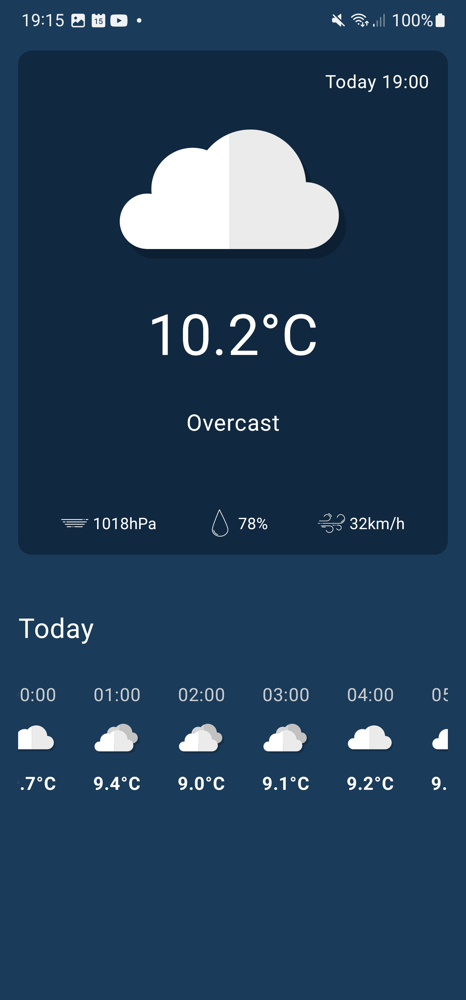
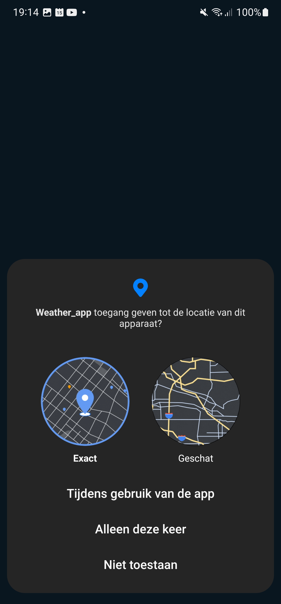
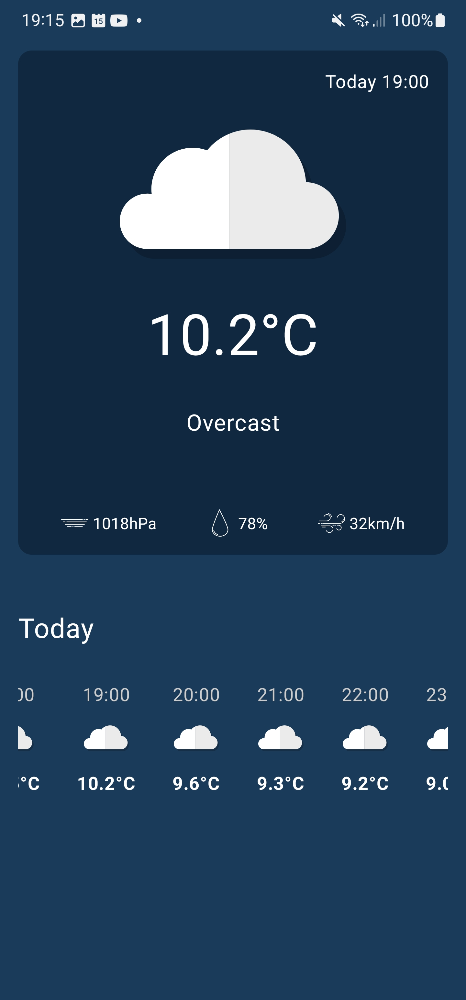

# Weather
Weather app
# Weather App with Open-Meteo API and Current Location

The Weather app is a simple and easy-to-use weather app that displays the current weather conditions for your current location. With seamless Open-Meteo API integration, the app displays the current temperature, humidity, wind speed, and weather conditions. Let the Weather app help you stay on top of the weather, so you never get caught in the rain!

I made this app following the tutorial from [Coding](https://www.youtube.com/watch?v=eAbKK7JNxCE). So I could improve my skills in Android Studio, Kotlin and clean architecture.

## Features
- Open-Meteo API integration for current weather conditions
- Current location for precise weather information
- Displays current temperature, humidity, wind speed, and weather conditions

  

